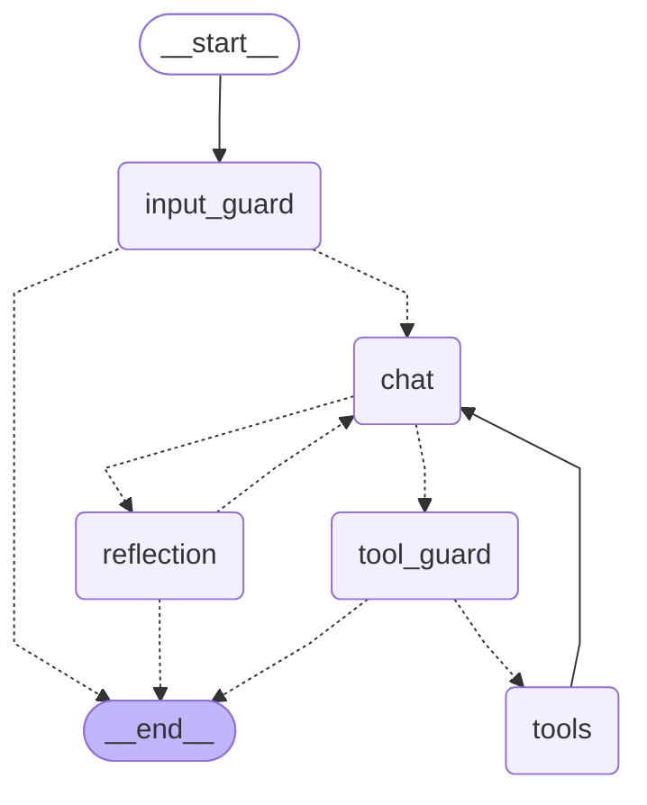

# LumenPilot LangGraph

该文件由 `LangGraphAgent.create_graph()` 自动生成。


```mermaid
---
config:
  flowchart:
    curve: linear
---
graph TD;
	__start__([<p>__start__</p>]):::first
	input_guard(input_guard)
	chat(chat)
	tool_guard(tool_guard)
	tools(tools)
	reflection(reflection)
	__end__([<p>__end__</p>]):::last
	__start__ --> input_guard;
	chat -.-> reflection;
	chat -.-> tool_guard;
	input_guard -.-> __end__;
	input_guard -.-> chat;
	reflection -.-> __end__;
	reflection -.-> chat;
	tool_guard -.-> __end__;
	tool_guard -.-> tools;
	tools --> chat;
	classDef default fill:#f2f0ff,line-height:1.2
	classDef first fill-opacity:0
	classDef last fill:#bfb6fc

```

## ASCII fallback

```text
ASCII rendering unavailable; install optional grandalf.
```
